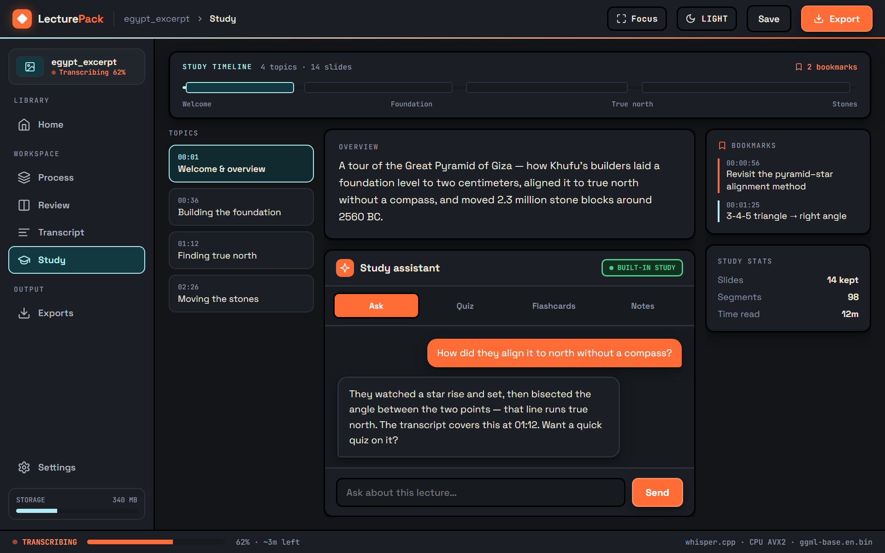
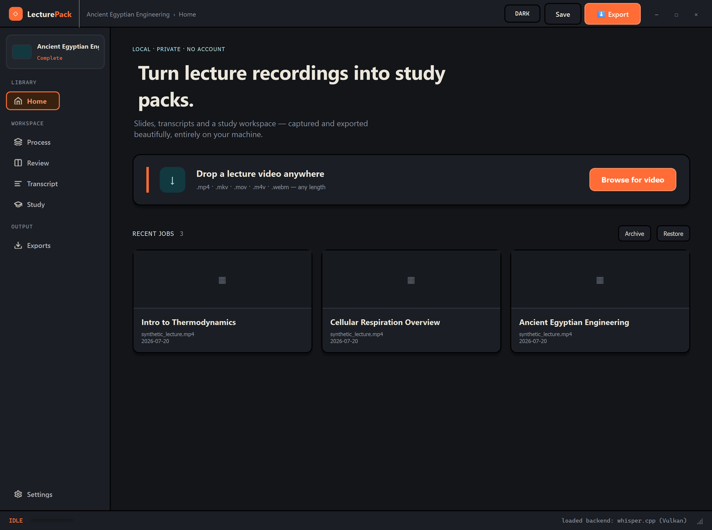
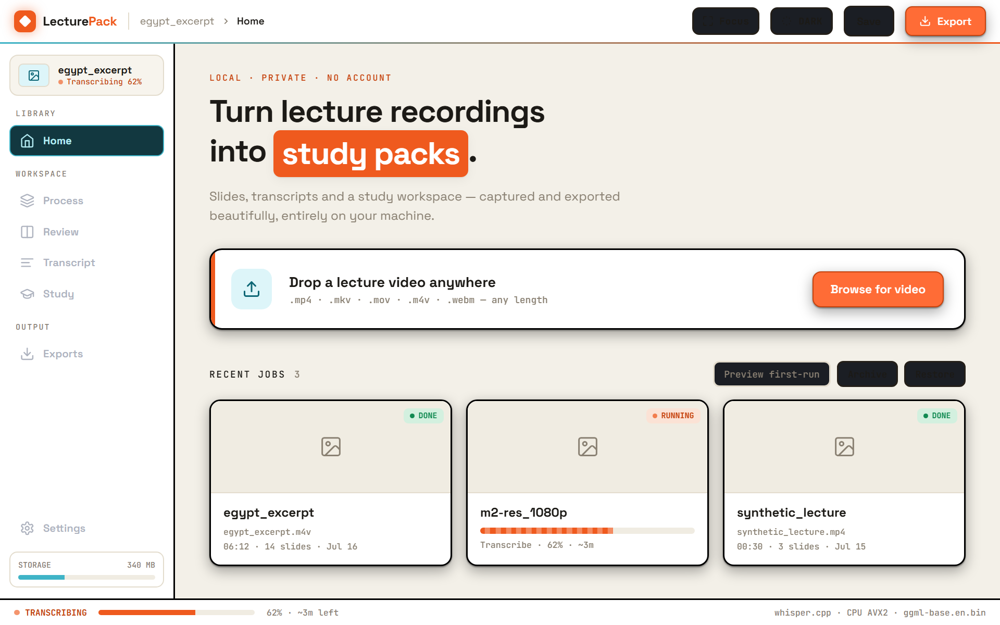
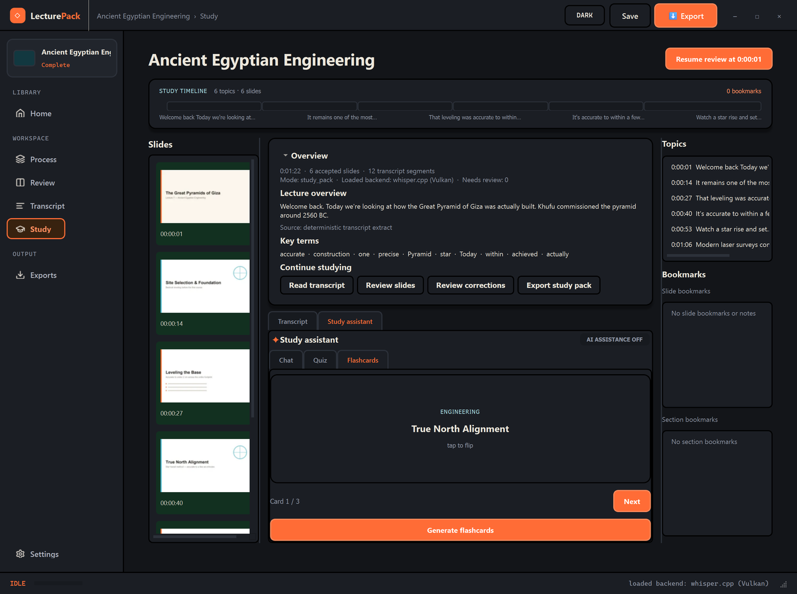
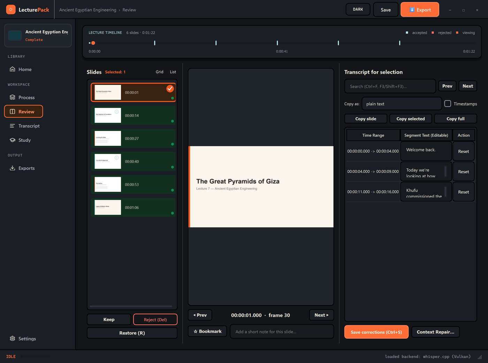
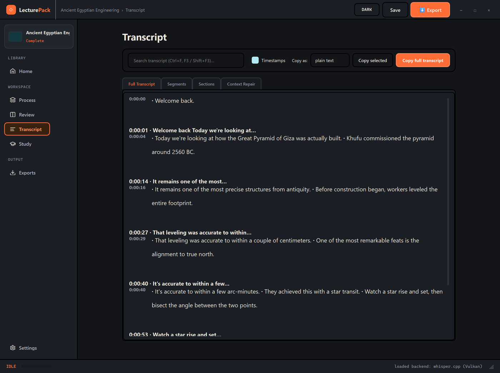
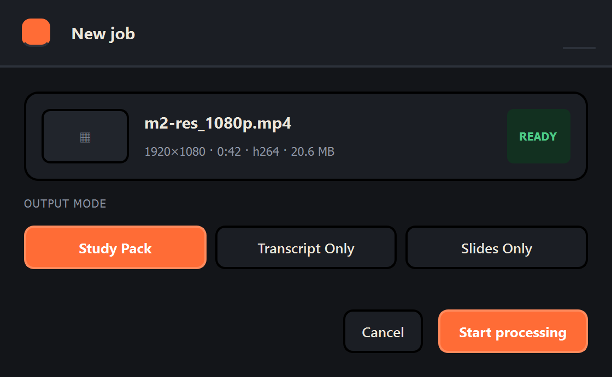
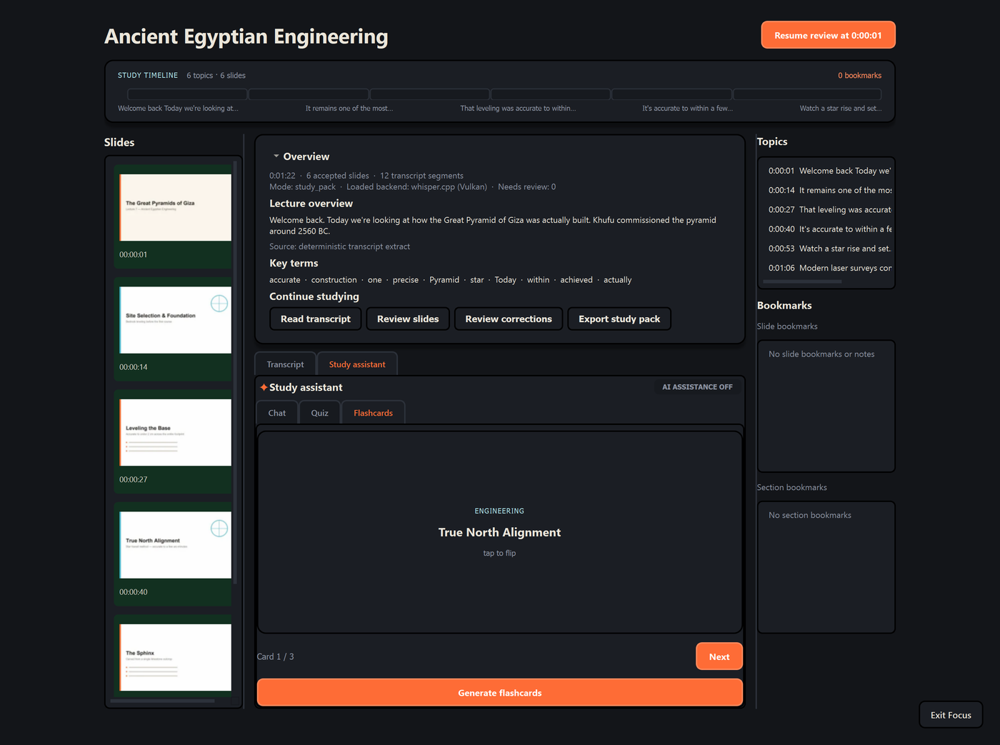

# LecturePack

> **Public Beta — 0.9.0-beta.1.** The core lecture workflow (transcription, slides, transcript, exports, built-in quizzes/flashcards) works immediately after installation with no account, API key, or Ollama. Optional **Smart Study** adds private local AI. This is a public beta — keep copies of important source videos and exports, and please report issues. See [release notes](docs/RELEASE_NOTES_0.9.0-beta.1.md).

Turn a lecture recording into a synchronized, editable study workspace — completely locally on your Windows machine. No cloud. No account. No upload.


<p align="center">
  <a href="https://github.com/pasttrunks/lecturepack/releases/download/v0.9.0-beta.1/LecturePack-0.9.0-beta.1-Setup.exe">
    
  </a>
</p>
<p align="center">
  <sub>Windows 10/11 · per-user install, no admin required · also available as a
  <a href="https://github.com/pasttrunks/lecturepack/releases/download/v0.9.0-beta.1/LecturePack-0.9.0-beta.1-Portable.zip">Portable ZIP</a> ·
  <a href="https://github.com/pasttrunks/lecturepack/releases">all releases</a> ·
  verify with <a href="https://github.com/pasttrunks/lecturepack/releases/download/v0.9.0-beta.1/LecturePack-0.9.0-beta.1-SHA256SUMS.txt">SHA256SUMS</a></sub>
</p>



---

## What It Does

LecturePack ingests a recorded university lecture video and produces a complete study package:

1. **Inspect** video metadata via ffprobe
2. **Extract** audio to 16 kHz mono (bundled FFmpeg)
3. **Transcribe** with whisper.cpp (CPU or optional Vulkan GPU)
4. **Detect slides** with an adaptive computer-vision pipeline
5. **Align** transcript segments to slide intervals
6. **Review** — correct slides and transcript, approve or reject context repairs
7. **Export** — slides PDF, HTML study pack, transcripts in 7+ formats

All processing runs **locally**. The optional AI features only talk to an endpoint you configure (Ollama, LM Studio, or any OpenAI-compatible server on localhost).

---

## Screenshots

<p align="center">
  
  
</p>
<p align="center"></p>

---

## Features

### Studio Design Language

An orange-and-cyan "Studio" interface built entirely in Qt Widgets: frameless window with a custom title bar, a scrubbable timeline spine, soft multi-layer shadows, 2px structural borders, animated page transitions, and full light/dark theming with Space Grotesk + JetBrains Mono type.

### AI Study Assistant

A local chat, quiz, and flashcard generator for whatever you just transcribed — grounded in the actual lecture transcript, backed by your own local Ollama model, and fully optional (the app works completely without it). Nothing leaves your machine.

### Study Workspace

A three-column workspace: an accepted-slide rail on the left, a tabbed Overview/Transcript/AI Assistant panel in the center, and Topics + Bookmarks on the right. A segmented Study Timeline across the top shows every topic at a glance — click any segment to jump straight to it.

<p align="center"> </p>

### Guided Onboarding

Drop a video or browse for one, confirm the real inspected file details, and pick an output mode (Study Pack / Transcript Only / Slides Only) — all in one focused "New job" dialog before handing off to processing.

### Focus & Flow Mode

Collapse the nav rail, command bar, and status bar away with a smooth iris-style transition — leaving only your study content and a floating exit button. Press `Esc` to exit.

<p align="center"> </p>

### Incremental Streaming Transcription

Whisper.cpp output is parsed incrementally via `QProcess`, streaming live transcript segments to the UI as they arrive. No waiting for the full run to finish.

### Layered Persistence

A four-layer transcript model that **never silently overwrites** what Whisper produced:

| Layer | Description |
|-------|-------------|
| **Raw** | Immutable whisper.cpp output, guarded by SHA-256 hash |
| **Normalized** | Deterministic cleanup — whitespace, hallucination collapse, paragraph grouping. Never changes words, names, or facts |
| **Context Proposals** | Optional, reversible corrections from a local LLM or deterministic approved-name matching |
| **User-Approved** | Only the corrections you explicitly accept, applied to a fresh projection |

### Provider-Neutral Backends

A pluggable transcription registry. Ships with `LocalWhisperCppBackend` (private, local) and `GroqTranscriptionBackend` (online, optional). Approved adapters register beside the local default — the job controller only sees the neutral start/progress/result/cancel contract.

### Concurrent Pipeline

Transcription and slide detection run **concurrently** after audio extraction. On the reference PC (AMD RX Vega 56), a 6-minute excerpt dropped from **156 s to 48 s** (−69%).

### Product Modes

| Mode | Produces |
|------|----------|
| **Study Pack** (default) | Slides PDF, HTML study pack, all transcript formats |
| **Transcript Only** | Transcript formats (no slide detection) |
| **Slides Only** | Slides PDF (no audio / whisper) |

---

## Quick Start

### Development Setup

```bash
# Clone
git clone https://github.com/pasttrunks/lecturepack.git
cd lecturepack

# Create venv and install
python -m venv .venv
.venv\Scripts\activate
pip install -e .

# Run
python -m lecturepack.app
```

### Run Tests

```bash
.venv\Scripts\python.exe -m pytest
```

### Build Portable Package

```bash
python build_release.py
```

### Portable Install (No Python Required)

1. Download `LecturePack-portable-X.Y.Z.zip` from the release
2. Verify the checksum against `SHA256SUMS.txt`
3. Extract anywhere (spaces in path are fine)
4. Run `LecturePack.exe`
5. Point the app at a Whisper model (e.g. `ggml-base.en.bin`) on first run

---

## Architecture

```
┌──────────────────────────────────────────────────┐
│  UI Layer — PySide6 Qt Widgets (main thread)     │
│  Home · Study · Process · Review · Transcript ·  │
│  Exports · Settings                              │
├──────────────────────────────────────────────────┤
│  Controller Layer — JobController (state machine) │
│  Presets · Stage orchestration · Cancel/resume   │
├──────────────────────────────────────────────────┤
│  Service Layer                                    │
│  TranscriptionService · SlideDetector ·          │
│  AlignmentEngine · ExportService · StudyService  │
├──────────────────────────────────────────────────┤
│  Infrastructure Layer                             │
│  FFmpegWrapper · WhisperWrapper · CVEngine ·     │
│  ConfigManager · FileManager · SecretStore       │
├──────────────────────────────────────────────────┤
│  External Processes                               │
│  ffmpeg/ffprobe.exe · whisper-cli.exe · Ollama   │
└──────────────────────────────────────────────────┘
```

### Thread & Process Model

- **QProcess** for external CLI tools (FFmpeg, whisper-cli) — non-blocking, integrates with Qt event loop, captures stdout/stderr via signals
- **QThread** workers for internal Python processing (OpenCV, hashing, ReportLab) — emit progress signals consumed by the UI
- **Cancellation**: QProcess uses `terminate()` (WM_CLOSE); QThread workers check a cancellation flag between iterations

### Data Layout

```
~/LecturePackData/
  config.json
  jobs/<job-uuid>/
    manifest.json, source.json, settings.json, state.json
    audio/, transcript/, frames/, exports/, logs/
    study.json
  models/
  logs/app.log
```

---

## Optional: Local AI (Ollama)

With [Ollama](https://ollama.com) installed, LecturePack can propose transcript corrections and section headings, and power the Study Assistant's chat, quiz, and flashcard generation (recommended: `qwen3:1.7b`). All output is schema-validated, generated off the GUI thread, and transcript corrections are **never auto-accepted** — you review and approve them explicitly. Without Ollama, the app still works: the deterministic offline provider handles corrections, and the Study Assistant simply stays off.

Setup: [docs/OLLAMA_SETUP.md](docs/OLLAMA_SETUP.md)

---

## Documentation

| Document | Description |
|----------|-------------|
| [PRODUCT_SPEC.md](docs/PRODUCT_SPEC.md) | Full product specification |
| [ARCHITECTURE.md](docs/ARCHITECTURE.md) | Layered architecture, thread model, pipeline |
| [DECISIONS.md](docs/DECISIONS.md) | All technical decisions with rationale |
| [STUDY_WORKSPACE.md](docs/STUDY_WORKSPACE.md) | Study workspace design and behavior |
| [PERFORMANCE_AND_BACKENDS.md](docs/PERFORMANCE_AND_BACKENDS.md) | Benchmarks and engine selection |
| [TRANSCRIPTION_AND_CONTEXT_REPAIR.md](docs/TRANSCRIPTION_AND_CONTEXT_REPAIR.md) | Layered transcript model |
| [CHANGELOG.md](CHANGELOG.md) | Release history |

---

## Limitations

- Automatic transcription is **not perfect**. `base.en` mishears proper nouns and technical terms; the Whisper `--prompt` only weakly biases these. Context Repair helps but is a *proposal* you review — it is not ground truth.
- Slide detection targets *lecture slides*; embedded video content yields scene keyframes, not "slides"; the Conservative preset intentionally under-captures.
- Windows x64 only. Unsigned binary — SmartScreen may warn on first launch.

---

## Privacy

All processing is local. Job data lives under `~/LecturePackData`. No telemetry, analytics, advertising, or network requests beyond first-run model downloads and localhost endpoints you configure. See [docs/PRIVACY_AND_DATA.md](docs/PRIVACY_AND_DATA.md).

---

## License

MIT License. See [THIRD_PARTY_NOTICES.txt](THIRD_PARTY_NOTICES.txt) for bundled binary licenses (FFmpeg is GPL; whisper.cpp is MIT).

---

## Contributing

Contributions welcome! Please read [CONTRIBUTING.md](CONTRIBUTING.md) before submitting a PR. The safety rules are strict — never delete `LecturePackData`, never modify original lecture videos, and always preserve layered persistence.
