# Lecture Pack -- Architecture

**Version:** 1.0  
**Date:** 2026-07-15  
**Status:** Approved (Phase 0)

---

## 1. Layered Architecture

```
Layer 4: UI Layer           (PySide6 Qt Widgets, main thread only)
Layer 3: Controller Layer   (job orchestration, state machine, presets)
Layer 2: Service Layer      (transcription, slide detection, export, alignment, LLM)
Layer 1: Infrastructure     (FFmpeg/whisper wrappers, CV engine, file I/O, config, logging)
```

**Rules:**
- Each layer may only call the layer directly below it.
- The UI layer never calls infrastructure directly.
- Services never reference UI widgets.
- Infrastructure never holds application state.

---

## 2. Component Diagram

```mermaid
graph TB
    subgraph "UI Layer"
        HomeScreen["Home / Queue"]
        SetupScreen["Lecture Setup"]
        SlideReview["Slide Review"]
        TranscriptReview["Transcript Review"]
        ExportScreen["Exports"]
        SettingsScreen["Settings & Diagnostics"]
    end

    subgraph "Controller Layer"
        JobController["JobController"]
        JobQueue["JobQueue"]
        PresetManager["PresetManager"]
    end

    subgraph "Service Layer"
        InspectorSvc["VideoInspector"]
        AudioSvc["AudioExtractor"]
        TranscriptionSvc["TranscriptionService"]
        SlideDetectorSvc["SlideDetector"]
        AlignmentSvc["AlignmentEngine"]
        ExportSvc["ExportService"]
        LLMSvc["LLMService"]
    end

    subgraph "Infrastructure Layer"
        FFmpegWrapper["FFmpegWrapper"]
        WhisperWrapper["WhisperWrapper"]
        CVEngine["CVEngine"]
        HashEngine["HashEngine"]
        PDFEngine["PDFEngine"]
        HTMLEngine["HTMLEngine"]
        ConfigManager["ConfigManager"]
        FileManager["FileManager"]
        LogManager["LogManager"]
        ModelDownloader["ModelDownloader"]
    end

    subgraph "External Processes"
        FFmpeg["ffmpeg.exe / ffprobe.exe"]
        WhisperCLI["whisper-cli.exe"]
    end

    subgraph "External (Optional)"
        LMStudio["LM Studio localhost:1234"]
    end

    HomeScreen --> JobController
    SetupScreen --> JobController
    SlideReview --> JobController
    ExportScreen --> ExportSvc
    SettingsScreen --> ConfigManager

    JobController --> JobQueue
    JobController --> PresetManager
    JobController --> InspectorSvc
    JobController --> AudioSvc
    JobController --> TranscriptionSvc
    JobController --> SlideDetectorSvc
    JobController --> AlignmentSvc
    JobController --> ExportSvc

    InspectorSvc --> FFmpegWrapper
    AudioSvc --> FFmpegWrapper
    TranscriptionSvc --> WhisperWrapper
    SlideDetectorSvc --> CVEngine
    SlideDetectorSvc --> HashEngine
    ExportSvc --> PDFEngine
    ExportSvc --> HTMLEngine
    LLMSvc --> LMStudio

    FFmpegWrapper --> FFmpeg
    WhisperWrapper --> WhisperCLI
```



---

## 3. Thread and Process Model

```
Main Thread (Qt Event Loop)
  |
  +-- All UI widgets and rendering
  |
  +-- JobController (state machine, signal routing)
       |
       +-- QProcess: ffprobe          (video inspection)
       +-- QProcess: ffmpeg           (audio extraction)
       +-- QProcess: whisper-cli      (transcription)
       |
       +-- QThread Worker: SlideDetector     (OpenCV frame comparison)
       +-- QThread Worker: ExportGenerator   (PDF/HTML generation)
       +-- QThread Worker: AlignmentEngine   (transcript-slide matching)
```

- **QProcess** for external CLI tools (FFmpeg, whisper-cli). Non-blocking, integrates with Qt's event loop. Captures stdout/stderr in real-time via signals.
- **QThread** with worker objects for internal Python processing (OpenCV, hashing, ReportLab). Workers emit progress signals consumed by the UI.
- **Signal flow:** Workers and QProcesses emit signals. The JobController aggregates them and forwards to the UI. The UI never directly accesses worker internals.
- **Cancellation:** QProcess uses `terminate()` (WM_CLOSE on Windows). QThread workers check a cancellation flag between iterations.

---

## 4. Processing Pipeline

Eight sequential stages, each independently tracked in `state.json`:

| # | Stage | Tool | Isolation | Output |
|---|---|---|---|---|
| 1 | Inspect | ffprobe via QProcess | Out-of-process | `source.json` |
| 2 | Extract Audio | FFmpeg via QProcess | Out-of-process | `audio/lecture-16khz-mono.wav` |
| 3 | Transcribe | whisper-cli via QProcess | Out-of-process | `transcript/raw.json`, `raw.srt`, `raw.txt` |
| 4 | Extract Frames | OpenCV via QThread | In-process worker | `frames/candidates/*.png` + metadata JSON |
| 5 | Detect Slides | OpenCV + imagehash via QThread | In-process worker | Accepted/rejected classification |
| 6 | Deduplicate | imagehash via QThread | In-process worker | Near-duplicates moved to rejected |
| 7 | Align | Python via QThread | In-process worker | Slide-to-transcript segment mappings |
| 8 | Export | ReportLab, img2pdf, Jinja2 | In-process worker | `exports/` directory |

---

## 5. State Management and Crash Recovery

- `state.json` is written atomically: write to `state.json.tmp`, then `os.replace()` to final name.
- Each stage status: `pending` | `running` | `completed` | `failed` | `cancelled` | `skipped`.
- On startup, any job with `"overall_status": "running"` is reclassified as `"interrupted"`.
- Resume skips `"completed"` stages, restarts from first incomplete.
- Output files written to temporary names (`*.tmp`), renamed on completion.
- If `state.json` is missing or corrupt, recovery mode inspects which files exist.

---

## 6. Source Fingerprint

```json
{
    "path": "C:\\Users\\...\\video.mp4",
    "file_size": 2147483648,
    "modified_time": 1752595200.0,
    "duration_ms": 3600000,
    "partial_hash": "sha256:..."
}
```

Partial hash: SHA-256 of (first 64 KB + last 64 KB + file size as 8-byte big-endian). Runs in milliseconds on any file size.

---

## 7. Slide Detection Algorithm

Three-stage tiered cascade. See `docs/IMPLEMENTATION_PLAN.md` Section 4 for full specification.

**Summary:**
1. dHash fast screen (rejects ~80% of frames as near-duplicates)
2. SSIM confirmation (resolves ~15%)
3. Histogram + pixel diff tiebreaker (resolves ~5%)

Preprocessing: crop, mask, downscale 480px, grayscale, Gaussian blur, temporal median filter.

Post-processing: stability detection, change type classification, sequential + global deduplication.

---

## 8. External Binary Strategy

| Binary | Version | Bundled? | Location | Source |
|---|---|---|---|---|
| ffmpeg.exe | 8.1.x | Yes | `bin/ffmpeg.exe` | gyan.dev Release Essentials (LGPL) |
| ffprobe.exe | 8.1.x | Yes | `bin/ffprobe.exe` | Same |
| whisper-cli.exe | v1.9.1 | Yes | `bin/whisper-cli.exe` | whisper.cpp releases (CPU build) |

Resolved at runtime via `sys._MEIPASS` (packaged) or project root (development). Never on system PATH.

---

## 9. Whisper Backend Selection

```
1. If settings.whisper.backend == "cpu":     force CPU
2. If settings.whisper.backend == "vulkan":  attempt Vulkan, fail with error if unavailable
3. If settings.whisper.backend == "auto":
   a. Check if Vulkan-enabled whisper-cli exists
   b. Run a 5-second probe transcription
   c. Parse stderr for "ggml_vulkan" / "whisper_backend_init_gpu" patterns
   d. If Vulkan initializes: use Vulkan, record "backend_used": "vulkan"
   e. If Vulkan fails: fall back to CPU, record "backend_used": "cpu"
   f. Log the result
```

CPU is the primary path. Vulkan is the optional accelerator.

---

## 10. Data Directory Layout

```
LecturePackData/                 (default: ~/LecturePackData, configurable)
  config.json                    (user settings)
  jobs/<job-uuid>/               (per-lecture working directory)
    manifest.json, source.json, settings.json, state.json
    audio/, transcript/, frames/, exports/, logs/
  models/                        (downloaded Whisper models)
    ggml-small.en.bin
  logs/app.log                   (application-level log)
```

---

## 11. Key Design Decisions

All decisions are recorded in `docs/DECISIONS.md`. Summary:

| ID | Decision | Reference |
|---|---|---|
| AD-1 | QProcess for external tools, QThread for internal processing | DECISIONS.md |
| AD-2 | Per-stage state machine with atomic writes | DECISIONS.md |
| AD-3 | Plain files + JSON manifests, no database | DECISIONS.md |
| AD-4 | Application-relative paths for external binaries | DECISIONS.md |
| AD-5 | Deterministic CV pipeline for slide detection | DECISIONS.md |
| AD-6 | ReportLab for study-pack PDF, img2pdf for slides-only PDF | DECISIONS.md |
| AD-7 | Self-contained HTML with base64 images | DECISIONS.md |
| AD-8 | PyInstaller over Nuitka for initial packaging | DECISIONS.md |

---

## 12. As-built addendum (v1.0.1)

The sections above are the original Phase-0 design. The shipped v1.0.1
implementation differs in these respects:

**Stages (7, not 8).** `constants.STAGES` = Inspect → Extract Audio → Transcribe →
Detect Slides → Align → Review Ready → Export. Frame extraction, detection and
dedup are all inside the single **Detect Slides** stage (`cv_engine.SlideDetectorWorker`).
Export is user-triggered, not auto-run.

**Product modes.** `JobController.run_next_stage` gates stages by the job's
`product_mode` (`STAGES_SKIPPED_BY_MODE`): Transcript Only skips Detect Slides;
Slides Only skips Extract Audio + Transcribe. `ExportService` writes only the
mode-appropriate artifacts.

**Layered transcript & Context Repair.** `services/transcript_service.py`
implements the four-layer model (raw / normalized / context proposals /
user-approved). After Transcribe, the controller writes `normalized.json` and
`context_candidates.json`. `ui/context_repair_dialog.py` is the review workspace;
`services/transcript_formats.py` provides the section grouping and the
`txt/md/json/jsonl/csv/srt/vtt` serializers shared by the workspace and exports.
Context Repair uses a local OpenAI-compatible LLM if configured, else a
deterministic approved-name provider that cannot invent names.

**Slide detector (as-built).** The shipped detector uses a rolling motion
baseline with a two-path (major / progressive-build) decision, plus the v1.0
overlay-band and major-change-persistence precision guards. (The tiered
dHash→SSIM→histogram cascade in §7 is the original design; the shipped combined
score is `0.4·ssim_dist + 0.3·dhash + 0.3·pixel_diff` gated by the baseline.)

**Binaries.** `whisper-cli.exe` and its `ggml*.dll` sit next to `LecturePack.exe`;
`ffmpeg.exe`/`ffprobe.exe` under `bin/`. Models are **not** bundled and are not
auto-downloaded. Backend is CPU-only in this build.

**Headless drivers.** `app.py` exposes `--selftest` (launch check) and
`--run-acceptance` (full end-to-end packaged pipeline driver in
`services`/`lecturepack.acceptance`), used to validate the packaged build.


## v1.1 additions

### Pipeline
- `infrastructure/video_reader.py` — `AnalysisFrameStream` (single FFmpeg
  rawvideo pipe: fps -> crop -> scale -> gray) + `FrameCursor` (sliding
  window with look-ahead) + `capture_native_frames` (pass-2 full-res seeks).
- `infrastructure/cv_engine.py` — same v1.0 decision logic over the piped
  frames; legacy cv2 seek path retained as automatic fallback; deferred
  min-time acceptance.
- `controllers/job_controller.py` — parallel stage group (Transcribe +
  Detect Slides), user-cancel latch, retired-worker reaping, stage cache
  fingerprints (`stage_fingerprints.json`), `backend_info`/`stage_cached`
  signals.
- `infrastructure/transcription_engines.py` — engine registry/policy
  (verified CPU binary vs optional `bin/vulkan` build); wrapper reports the
  actually loaded backend from whisper.cpp output.

### Transcript data
- `services/transcript_store.py` — working layer (`working.json`, schema 2):
  full segment list with `origin_ids`, supporting split/merge/edit while raw
  stays immutable; mirrors legacy `edited.json`; consumed by exports and all
  transcript views.

### AI
- `infrastructure/ollama_client.py` — stdlib streaming client (typed errors,
  finite timeouts, cancel events, JSON-schema constrained chat, response
  cache) + `OllamaRepairProvider` adapter into the existing
  `ContextRepairEngine` guardrails.
- `services/ai_repair_service.py` — `AiRepairWorker` QThread with an absolute
  exception boundary; disk cache per job.

### UI
- `ui/main_window.py` — shell (nav rail, command bar, status bar, QSettings
  persistence) exposing v1.0-compatible aliases for tests/tooling.
- `ui/pages/` — home, process (collapsible settings + stage rows + logs),
  review (3-pane), transcript (Full/Segments/Sections/Context Repair tabs),
  exports, settings.
- `ui/widgets/slide_grid.py` — selection-visual delegate driven by
  `theme.selection_visuals` (unit-testable) + WebP thumbnail loader thread.
- `ui/widgets/context_repair_panel.py` — proposal table shared by the dialog
  and the Transcript tab.
