# Electron Migration Vertical Slice

**Date:** 2026-08-03  
**Status:** Implemented and verified on the development desktop; affected-laptop acceptance is still required  
**Scope:** Explicit Electron migration slice only. This is not Beta 15 and it does not replace the Qt product shell.

## Purpose and boundary

The earlier renderer spike proved static rendering, a JavaScript workload, and
Python engine import. This phase turns that seam into one real, portable user
path:

```mermaid
flowchart LR
    A[Electron launches] --> B[Packaged sidecar emits ready]
    B --> C[health_check and list_jobs]
    C --> D[Import bundled demo]
    D --> E[Real FFmpeg and whisper.cpp]
    E --> F[Slide detection and transcript]
    F --> G[Study Pack export]
    G --> H[Close and clean process tree]
    H --> I[Reopen and restore completed job]
```



The existing `lecturepack` engine remains the processing implementation. The
sidecar is a headless adapter around it, and the existing `app/ui` remains the
browser UI. No Qt widget or WebEngine view is created by the sidecar.

Out of scope for this phase:

- Beta 15 or a product-version bump.
- React conversion, frontend redesign, or new Qt graphics/CSS experiments.
- Rewriting the Python engine.
- Installer, updater, release signing, or the remaining desktop bridge methods.
- GPU/Vulkan/CUDA packaging.
- Requiring Python or PySide6 to be installed on the customer laptop.

## Components

### Electron host

`electron-spike/main.js` adds the explicit `migration` mode while retaining the
three earlier diagnostic modes. It:

1. Builds a temporary local HTML document from the real `app/ui/index.html`.
2. Removes the Qt WebChannel script and injects `electron-bridge.js`.
3. Starts the packaged `LecturePackSidecar.exe` when available. Source runs use
   the locked `.venv` Python only as a developer fallback.
4. Sends sidecar events to the UI without exposing Node or Electron objects to
   the renderer.
5. Bootstraps health, job restore, demo import, and real processing.
6. Writes session JSONL evidence under the requested results directory.
7. Sends shutdown and terminates the entire sidecar process tree as a final
   cleanup guard, preventing orphaned Python, FFmpeg, or whisper processes.

### Headless sidecar

`electron-spike/python-sidecar.py` uses `QCoreApplication`, `QTimer`, and the
existing QtCore-based `JobController`. It imports no `QtWidgets` or
`QtWebEngine` module and does not create a window. The stdin reader starts only
after engine bootstrap; this avoids a Windows pipe-read starvation observed
when the locked environment was importing OpenCV/PySide6.

The sidecar configures the existing engine to use the packaged CPU runtime:

- `bin/ffmpeg.exe`
- `bin/ffprobe.exe`
- `bin/Release/whisper-cli.exe`
- `models/ggml-base.en.bin`

PyInstaller 6 places collected onedir data under `_internal`; runtime-root
resolution explicitly handles that layout.

## JSONL contract

Each request is one JSON object on stdin:

```json
{"request_id":"migration-123-7","command":"health_check","payload":{}}
```

Successful command responses contain `event: "response"` and echo the request
ID in `response_to`. Failures use the `error` event with `ok: false` and the
same `response_to` when a request ID was supplied. Unsolicited events never
depend on a request remaining open.

| Command | Purpose | Important response/event data |
| --- | --- | --- |
| `health_check` | Verify engine and packaged runtime | `healthy`, `paths`, `qt_application` |
| `list_jobs` | Enumerate persisted jobs | `jobs` plus `jobs_changed` |
| `import_video` | Create a persisted job | `job_id`, summary, `active_job` |
| `start_job` | Run the existing pipeline | `status_changed`, `pipeline_changed`, `log_line` |
| `cancel_job` | Cancel the active pipeline | cancelled response and status event |
| `get_job` | Restore one persisted job | manifest, source, state, exports |
| `get_slides` | Read detected slide candidates | `slides_changed` and slide list |
| `get_transcript` | Read canonical transcript | `transcript_changed` and transcript payload |
| `export` | Run the existing Study Pack exporter | export progress and `export_done` |
| `shutdown` | Stop the sidecar | response followed by process exit |

The sidecar emits these UI-facing events:

`ready`, `bootstrap_progress`, `jobs_changed`, `pipeline_changed`,
`status_changed`, `log_line`, `slides_changed`, `transcript_changed`, and
`error`. `active_job` and `export_done` are also emitted as narrow transport
events needed by the existing UI and restart proof.

The UI adapter maps the existing `lpBridge` calls used by `app.js` to the
contract above. Unsupported legacy actions resolve as no-ops in this slice;
they are not silently implemented with fake data.

Phase 7.1 compatibility details:

- The sidecar keeps its `jobs_changed` envelope as `{event, jobs}` for JSONL
  request/event diagnostics. `electron-bridge.js` converts that event to the
  direct JSON array required by `app/ui/app.js` before invoking its listener.
- `set_setting('theme', value)` is handled locally by the renderer adapter.
  The UI has already applied the theme, so the toggle does not create a
  sidecar request for every stress click.
- An active summary reports the existing UI value `status: "running"` while a
  current stage exists and Export is incomplete. It becomes `"done"` only
  after the terminal export state is persisted.
- Touched status and metadata strings use ASCII separators, and JSONL messages
  use ASCII-escaped JSON so the process boundary does not introduce visible
  replacement or mojibake characters.

## Packaging

Build from the locked project environment:

```powershell
cd C:\Users\marsh\Documents\LecturePack\electron-spike
npm install
npm run validate
npm run package:sidecar
npm run package:win
```

`package-sidecar.mjs` invokes:

```text
C:\Users\marsh\Documents\LecturePack\.venv\Scripts\pyinstaller.exe
```

with an argument array and `shell: false`. The sidecar spec creates an onedir
console executable at:

```text
electron-spike\dist-sidecar\LecturePackSidecar\LecturePackSidecar.exe
```

The Electron proof is produced at:

```text
electron-spike\dist\LecturePackRendererSpike-win32-x64\
```

The package includes the real UI, bundled demo video, and packaged sidecar.
It is an unpacked proof, not an installer or release artifact.

## Verification evidence

### Source sidecar

The source sidecar was launched with the locked `.venv`, then exercised with
the bundled demo. It produced:

- 103 `status_changed` events.
- 112 `pipeline_changed` events.
- 160 `log_line` events.
- 7 slide payloads and 7 transcript payloads.
- A real `export_done` event.
- Study Pack outputs: `study-pack.html`, `study-pack.pdf`, `study-data.json`,
  `slides.pdf`, and transcript TXT/SRT/JSON/JSONL/MD/CSV/VTT/sections files.
- Clean sidecar shutdown and no remaining Python, FFmpeg, or whisper process.

The same data directory was opened by a second sidecar launch. `list_jobs`,
`get_job`, `get_slides`, and `get_transcript` restored the job with status
`done`.

### Packaged sidecar

The packaged executable passed health checks for all four resources, with
PyInstaller's `_internal` paths resolved correctly. It completed the same real
processing/export/restart sequence and returned the restored job as `done`.

### Packaged Electron host

The unpacked Electron executable completed two launches using the same data
directory:

- First launch: 411 sidecar messages, real processing/export, exit code 0.
- Second launch: 24 sidecar messages, persisted job restore, exit code 0.
- Both launches recorded `sidecar_tree_terminated` and `sidecar_exit`.
- Neither launch recorded `page_load_failed`, `render_process_gone`, or
  `migration_bootstrap_failed`.
- The second launch saw a non-empty `jobs_changed` payload.
- The exported directory contained the full Study Pack set listed above.

The only stderr observed in the packaged host smoke was Electron's own
deprecation warning for the `console-message` event API; it did not indicate a
renderer failure.

### Focused automated tests

```text
pytest tests\test_renderer_spike.py -q
14 passed in 1.96s
```

The test file covers mode declarations, Node syntax, safe process spawning,
the headless contract, CPU-only packaging inputs, and a live source-sidecar
health/list/shutdown exchange.

## Affected-laptop gate

Development-machine evidence is not the acceptance decision. Copy the entire
unpacked `LecturePackRendererSpike-win32-x64` directory to the affected
laptop and run the migration executable there. Keep a dedicated results and
data directory so the evidence can be copied back:

```powershell
mkdir C:\LecturePackMigrationResults
mkdir C:\LecturePackMigrationData
.\LecturePackRendererSpike.exe --mode=migration `
  --results="C:\LecturePackMigrationResults" `
  --data-dir="C:\LecturePackMigrationData" `
  --duration-seconds=600
```

The migration mode automatically imports the bundled demo and starts the real
path. Let the exact guided Demo/process/review/export flow complete, then
close the app and launch the same command again to verify restore. During the
gate, record:

- ten-minute idle;
- repeated resizing;
- repeated theme switching;
- complete guided Demo;
- real processing and export;
- no flickers or black interval;
- no renderer crash or unresponsive event;
- no orphaned Python, FFmpeg, or whisper process;
- job and exports present after restart.

If the run fails, copy both directories back (or zip them):

- `C:\LecturePackMigrationResults\*.jsonl` for the Electron timeline;
- `C:\LecturePackMigrationData\jobs\<job-id>\` for manifest/state,
  transcript/slides artifacts, and exports.

Do not send university credentials or unrelated personal data. The bundled
demo path makes this gate local-only.

## Next decision boundary

Only after the affected laptop passes the gate should the project consider
migrating the remaining bridge methods, installer, updater, and release
packaging. Until then, this slice remains an isolated proof and the Qt product
shell remains unchanged.
