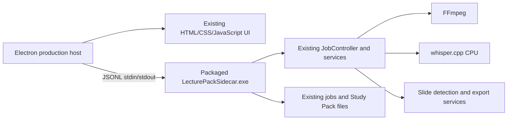

# Phase 8 - Electron Production App Core

**Date:** 2026-08-03  
**Status:** Implemented and verified on the development desktop; affected-laptop gate pending  
**Decision:** AD-26  
**Beta status:** Not Beta 15 until the affected-laptop gate passes

## Purpose

Phase 8 converts the Electron spike into the first real LecturePack
application path. It reuses the existing browser UI, Python engine, persisted
job format, and packaged runtime. It is deliberately a small implementation
phase, not another rendering investigation and not a full migration of every
secondary feature.

## First-build scope

The production candidate supports:

- Electron cold launch and sidecar bootstrap.
- Local video selection and import.
- Processing options before start: Study Pack, transcript-only, or slides-only
  product mode, plus conservative, balanced, or detailed slide detection
  preset.
- Real FFmpeg inspection/audio extraction.
- Real CPU whisper.cpp transcription.
- Real slide detection and alignment.
- Live status, pipeline progress, and log lines.
- Existing slides and transcript views.
- Study Pack export and export-folder access.
- Processing cancellation.
- Completed-job restore after a second launch.
- Graceful sidecar shutdown and Windows process-tree cleanup fallback.

The production package does not include the old static, mocked, Python
diagnostic, or launcher modes. Those files remain in the repository as
historical fallback evidence. The Qt application also remains in the
repository as the fallback product shell.

## Deferred scope

The following are intentionally outside the first build:

- updater and installer migration;
- Paste Link/yt-dlp;
- Ollama or Groq;
- React conversion or UI redesign;
- removal or rewrite of the Qt application/Python engine;
- GPU/Vulkan packaging;
- every minor setting and secondary bridge method.

## Runtime architecture



### Electron host

`electron-spike/production-main.js` is the only Electron entry point in the
production package. It creates one opaque BrowserWindow, loads a temporary
document built from `app/ui/index.html`, injects the existing bridge, starts
the sidecar, and restores the newest persisted job. The window is initially
hidden and is shown on `ready-to-show` to avoid a blank or partially painted
first frame.

`electron-spike/production-preload.js` exposes only the narrow request/event
surface. Node integration remains disabled and the renderer does not receive
the Electron `ipcRenderer` object directly.

The host handles the native local-video picker and opens job/export folders
through Electron's shell API. It passes all other supported commands through
the sidecar request map with a generated request ID and a bounded response
timeout.

On close, the host sends `shutdown` while keeping stdin open long enough for
the sidecar to read the command. The sidecar drains cancelled QThreads and
QProcesses for a bounded interval before quitting its QtCore loop. The host
waits for normal exit, then uses an exact `taskkill.exe /PID <sidecar-pid> /T
/F` fallback only if the sidecar does not exit. The same tree guard is used
from the final process-exit path.

### Sidecar

`electron-spike/python-sidecar.py` uses `QCoreApplication` only. It does not
create a Qt widget, WebEngine view, or customer-visible window. PySide6 remains
inside the packaged sidecar because the existing controller still imports
QtCore services such as `QProcess`, `QThread`, and `QTimer`; Python and PySide6
are not required on the customer laptop.

The sidecar resolves the packaged CPU runtime from its resource root:

- `bin/ffmpeg.exe`;
- `bin/ffprobe.exe`;
- `bin/Release/whisper-cli.exe`;
- `models/ggml-base.en.bin`.

The sidecar persists all output through the existing `Job` and controller
paths. It does not create a second job schema or a mock result path.

## JSONL contract

Each command is one line on sidecar stdin:

```json
{"request_id":"production-123-7","command":"health_check","payload":{}}
```

Supported commands:

| Command | Use |
| --- | --- |
| `health_check` | Verify engine and packaged runtime paths. |
| `list_jobs` | Enumerate persisted jobs and select the active job. |
| `import_video` | Inspect a local video and create a persisted job. |
| `start_job` | Run the existing real pipeline with selected options. |
| `cancel_job` | Request cancellation of the active pipeline. |
| `get_job` | Restore manifest, source, state, and export locations. |
| `get_slides` | Read detected slides. |
| `get_transcript` | Read the canonical transcript. |
| `set_slide_state` | Persist an accepted/rejected slide decision. |
| `save_corrections` | Persist transcript edits through the existing working layer. |
| `export` | Run the existing Study Pack exporter. |
| `set_setting` | Apply the first-build processing settings. |
| `shutdown` | Stop the sidecar cleanly. |

UI-facing events:

```text
ready
bootstrap_progress
bootstrap_complete
jobs_changed
pipeline_changed
status_changed
log_line
slides_changed
transcript_changed
export_progress
error
```

The sidecar wraps `jobs_changed` as `{event, jobs}` for transport diagnostics;
`electron-bridge.js` delivers the exact direct array expected by the existing
UI. Theme changes are intercepted locally so one theme toggle does not send a
sidecar request. JSONL is emitted with ASCII escaping so Windows code-page
conversion cannot produce a visible replacement character at the transport
boundary. An active job remains `running` until the terminal Export stage has
completed; only then does the summary become `done`.

## Build

Build from the locked project environment:

```powershell
Set-Location C:\Users\marsh\Documents\LecturePack\electron-spike
npm install
npm run validate
npm run package:win
```

The command rebuilds the PyInstaller sidecar and creates this unpacked
portable candidate:

```text
C:\Users\marsh\Documents\LecturePack\electron-spike\dist\LecturePack-win32-x64\
```

The folder must be transferred as a whole. The executable alone is not a
portable build because it depends on `resources\app.asar`, `resources\ui`,
`resources\lecturepack`, and the complete
`resources\LecturePackSidecar` onedir runtime.

Important package contents:

```text
LecturePack.exe
resources\app.asar
resources\ui\
resources\lecturepack\
resources\LecturePackSidecar\LecturePackSidecar.exe
resources\LecturePackSidecar\_internal\...
```

This is a portable acceptance candidate, not an installer, updater, or signed
release artifact.

## Development-desktop evidence

The final fresh-data packaged-sidecar run used a new data directory and the
bundled 24-second MP4. It reported:

- sidecar `ready` and healthy packaged runtime;
- real pipeline start and `job_completed`;
- 3 detected slides;
- 4 transcript segments;
- all Study Pack outputs, including `study-pack.html`, `study-pack.pdf`,
  `slides.pdf`, `study-data.json`, and transcript TXT/SRT/JSON/JSONL/MD/CSV/
  VTT/sections files;
- clean sidecar exit code `0`;
- a second sidecar launch restored the completed job as `done` with slides and
  transcript available;
- a packaged cancellation run returned `cancelled: true` and exited with code
  `0`;
- no Python, FFmpeg, whisper, or Electron process remained after the visible
  packaged UI candidate was closed.

The development-desktop run is evidence that the path works. It is not a
substitute for the affected-laptop acceptance gate.

## Affected-laptop acceptance gate

Use a newly created, empty data directory. Do not reuse prior spike data for
the first gate.

1. Copy the complete `LecturePack-win32-x64` directory to the laptop.
2. Create separate empty results and data directories, for example:

   ```powershell
   New-Item -ItemType Directory -Force C:\LecturePackPhase8Results
   New-Item -ItemType Directory -Force C:\LecturePackPhase8Data
   ```

3. Launch the candidate:

   ```powershell
   .\LecturePack.exe `
     --results="C:\LecturePackPhase8Results" `
     --data-dir="C:\LecturePackPhase8Data"
   ```

4. Complete the real user path: cold launch, choose a local lecture with
   **Browse for video**, choose the processing options, start processing, wait
   for completion, inspect slides and transcript, and export the Study Pack.
5. Close the app normally. Launch the same executable again with the same
   `--results` and `--data-dir` values. Confirm the completed job is restored.
6. During and after the run, verify ten-minute idle, repeated resize, theme
   changes, no flicker or black interval, no renderer crash, and no orphaned
   `LecturePackSidecar.exe`, Python, FFmpeg, or whisper processes.

Copy back only the relevant evidence:

- `C:\LecturePackPhase8Results\production-*.jsonl`;
- `C:\LecturePackPhase8Data\jobs\<job-id>\` including state, slides,
  transcript, and exports;
- a short note describing the laptop model/Windows version and whether each
  acceptance item passed.

Do not call the build Beta 15 until this fresh-data laptop gate passes and is
explicitly reviewed.
