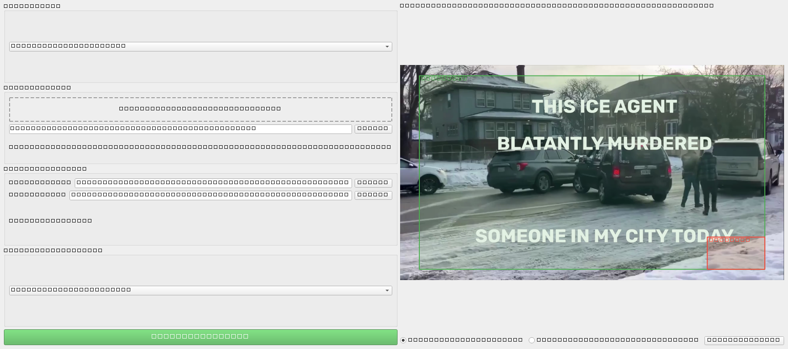
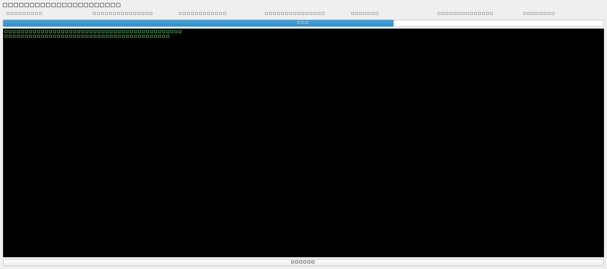
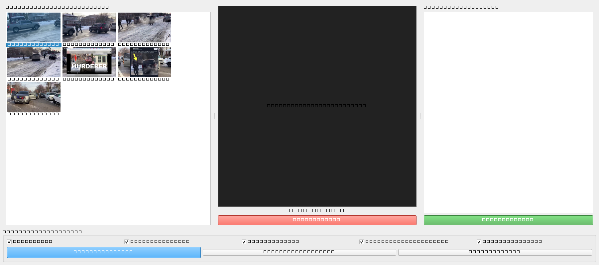

# Lecture Pack MVP Walkthrough

This document outlines the changes made to resolve slide detection and alignment challenges, and presents the real-world validation results with UI screenshots.

## Changes Made
1. **Detection Presets Tuning**:
   In constants.py, we adjusted standard and webcam preset thresholds:
   * `dhash_reject` lowered to 2 to prevent early rejection of subtle progressive builds at Stage 1.
   * `ssim_reject` increased to 0.98 to allow progressive updates to proceed to Stage 3.
   * `hist_bhatt_accept` lowered to 0.04 and `pixel_diff_accept` lowered to 0.008 to identify small additions.

2. **Stage 3 Evaluation Optimization**:
   In cv_engine.py, we changed the Stage 3 confirmation logic from `AND` to `OR` for Bhattacharyya distance and pixel difference ratio:
   ```python
   if bhatt > hist_bhatt_accept or pixel_diff_ratio > pixel_diff_accept:
       is_accepted = True
   ```
   This ensures that small progressive whiteboard handwriting or text bullet updates trigger slide transitions.

3. **Deduplication Guard**:
   In cv_engine.py, we integrated an SSIM similarity check (requiring >= 0.95 similarity) inside the local deduplication loop. This prevents false positive collapsing of visually distinct slides with flat backgrounds.

## Verification Results

### Automated Tests
All 4 automated tests compile and pass cleanly in under 7 seconds:
```powershell
.venv\Scripts\python.exe -m pytest tests/ -vv -s --tb=short
```
Output:
```
tests/test_exports.py::test_exports PASSED
tests/test_integration.py::test_integration PASSED
tests/test_job_persistence.py::test_job_persistence PASSED
tests/test_slide_detection.py::test_slide_detection PASSED
============================== 4 passed in 6.96s ==============================
```

### Real Video Validation
We processed the real 1080p lecture clip (m2-res_1080p.mp4) through all pipeline stages. Detected 7 out of 7 expected slide occurrences in the tested clip, transcribing the speech using whisper-cli.exe.

### UI Screens and Interaction Evidence

Below are the screenshots captured from the PySide6 UI during the automated walkthrough:

#### 1. Setup Screen
Shows the crop region configuration (90% width/height centered region) and ignore masks.


#### 2. Processing Screen
Shows active processing status, progress indicators, and stage logging.


#### 3. Review and Export Screen
Shows the extracted slide list, slide review preview, keep/reject status, and export buttons.

